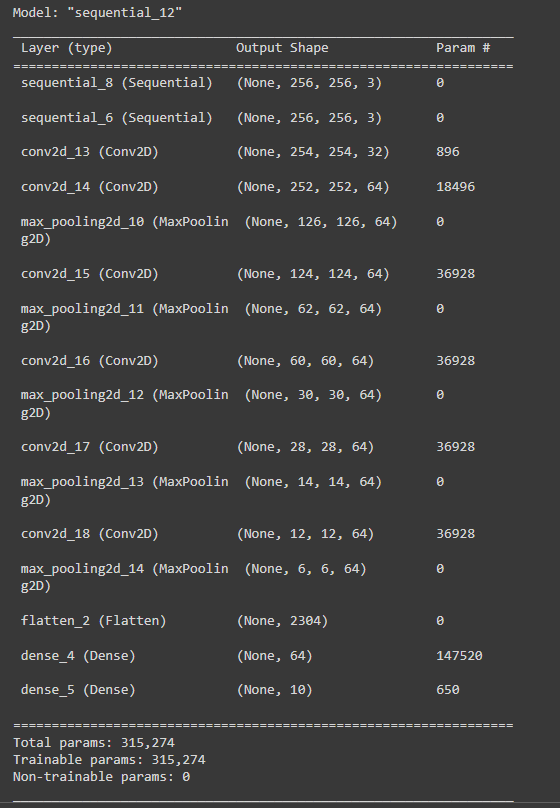
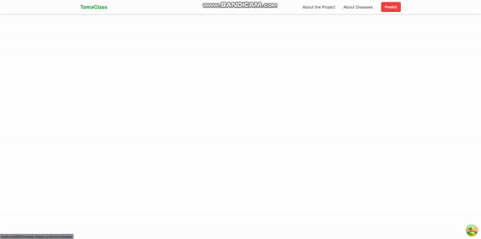

# Tomato Leaf Disease Classification Model

## Table of Contents

1. [Introduction](#introduction)
2. [Dataset](#dataset)
3. [Loading Data](#loading-data)
4. [Dataset Splitting](#dataset-splitting)
5. [Data Augmentation](#data-augmentation)
6. [Model Building](#model-building)
7. [Model Compilation](#model-compilation)
8. [Model Training](#model-training)
9. [Exporting the Model](#exporting-the-model)
10. [Model Training Link(Colab)](#model-training-link)
11. [API Integration with FastAPI](#api-integration-with-fastapi)
    - [Endpoint](#endpoint)
12. [Frontend](#frontend)
13. [Application Demo](#application-demo)
14. [Conclusion](#conclusion)

## Introduction

This repository contains a machine learning model designed to classify various diseases affecting tomato leaves. The model is trained using a dataset obtained from Kaggle and is implemented using TensorFlow and FastAPI.

## Dataset

The dataset used for this project can be found at the following link: [Kaggle Tomato Leaf Disease Classification Dataset](https://www.kaggle.com/datasets/kaustubhb999/tomatoleaf). It contains a total of 11,000 images distributed across 10 directories representing different classes of tomato leaf diseases:

- **Tomato Bacterial Spot**
- **Tomato Early Blight**
- **Tomato Late Blight**
- **Tomato Leaf Mold**
- **Tomato Septoria Leaf Spot**
- **Tomato Spider Mites (Two-Spotted Spider Mite)**
- **Tomato Target Spot**
- **Tomato Yellow Leaf Curl Virus**
- **Tomato Mosaic Virus**
- **Tomato Healthy**

## Loading Data

Data is loaded from the hard drive utilizing the TensorFlow Dataset API. The images are processed with a batch size of 32 and resized to 256x256 pixels. The class names correspond to the names of the folders containing each type of disease.

## Dataset Splitting

The dataset is split into training, testing, and validation datasets in the following proportions:

- **Training**: 75%
- **Validation**: 15%
- **Testing**: 10%

## Data Augmentation

To enhance the model's performance and prevent overfitting, the dataset undergoes augmentation. The augmentation pipeline includes caching, shuffling, and prefetching, optimizing loading times and ensuring a balanced distribution of the data.

## Model Building

The model is built using a Convolutional Neural Network (CNN) with the following architecture:

1. **Custom layer** to resize and rescale images (`resize_rescale`)
2. **Data augmentation layer** (randomly rotate and flip images)
3. **Five convolutional blocks** with:
   - `Conv2D(64, (3,3))` with ReLU activation and `MaxPooling(2,2)`
4. **Flatten layer**
5. **Fully connected layer** with 64 units
6. **Output layer** with softmax activation equal to the number of classes

## Model Compilation

- **Optimizer**: Adam
- **Loss Function**: Sparse Categorical Crossentropy
- **Metrics**: Accuracy

## Model Training

The model is trained on the training dataset for **20 epochs** with a batch size of **32**. The results after the final epoch are:

- **Loss**: 0.1539
- **Accuracy**: 94.63%

## Exporting the Model

The trained model is saved and ready for deployment in the application.

## Model Training Link

Link to the google colab for the model is [here](https://colab.research.google.com/drive/1TMHaz0E2e1P9zDd12JH9ICd21d1Bdef4#scrollTo=Tcbb724ZS0HA)

## API Integration with FastAPI

The model is integrated with FastAPI, exposing it through an endpoint that the frontend application can interact with.

### Endpoint

- **/predict**: A POST request is sent from the frontend containing the image of the tomato leaf to classify. The image is processed by the model, and predictions are returned as a response for further application.

## Frontend

The frontend of this application is developed using Next.js and styled with Tailwind CSS. The frontend repository can be found [here](https://github.com/codeflamer/ml-projects-frontend).

Users can upload an image of an infected tomato leaf, which is sent to the FastAPI backend for classification. The resulting class helps identify the type of disease and suggests preventive measures.

### Application Demo

## Conclusion

This tomato leaf disease classification model demonstrates the potential of machine learning in agricultural applications, enabling farmers and agricultural professionals to identify diseases quickly and accurately.
